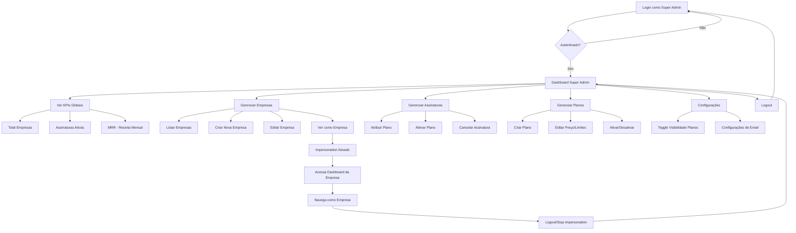
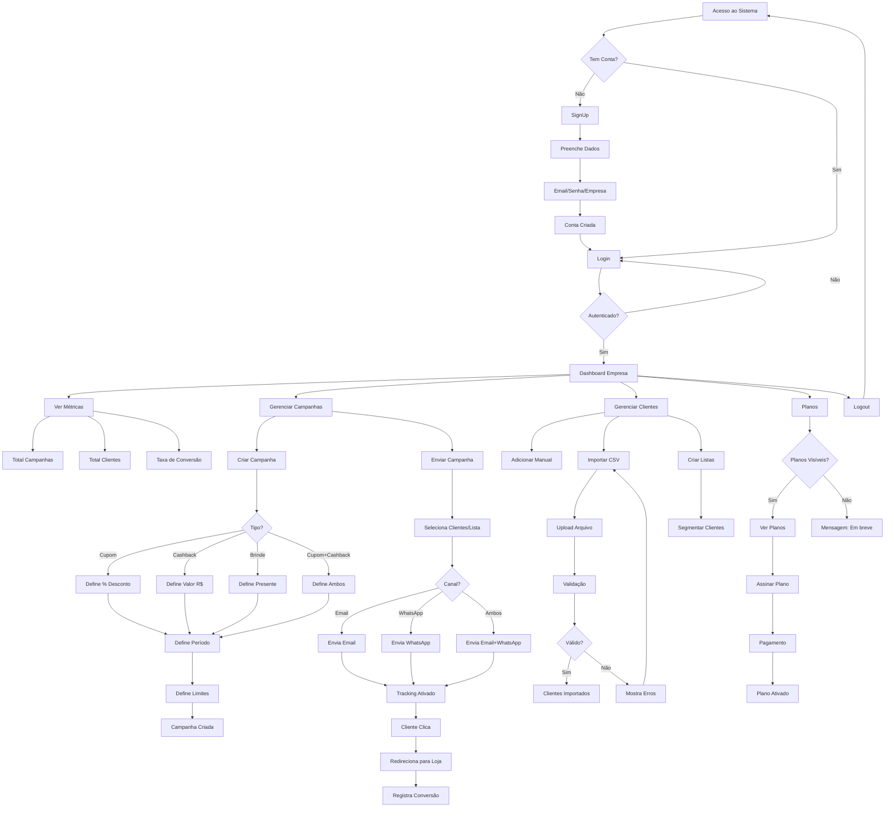
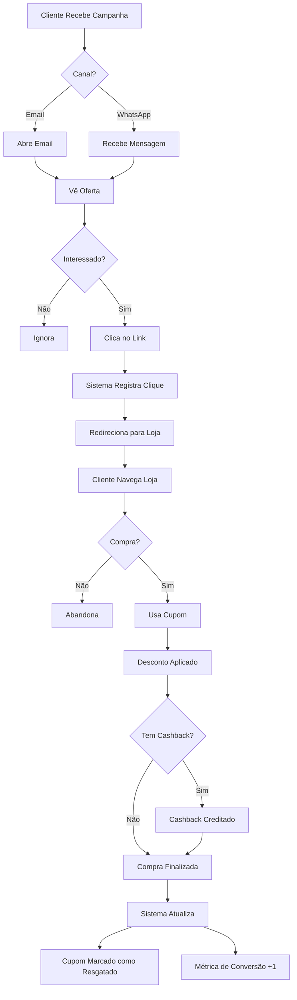

# 🚀 SaaS Campaign Platform

Plataforma SaaS multi-tenant para gerenciamento de campanhas de marketing digital, incluindo cupons de desconto, cashback, brindes e gestão de clientes.

---

## 📋 Índice

- [Sobre o Sistema](#-sobre-o-sistema)
- [Tecnologias Utilizadas](#-tecnologias-utilizadas)
- [Arquitetura](#-arquitetura)
- [Tipos de Usuário](#-tipos-de-usuário)
- [Regras de Negócio](#-regras-de-negócio)
- [Fluxogramas](#-fluxogramas)
- [Como Rodar o Projeto](#-como-rodar-o-projeto)
- [Estrutura do Projeto](#-estrutura-do-projeto)
- [API e Documentação](#-api-e-documentação)
- [Testes](#-testes)

---

## 🎯 Sobre o Sistema

Este é um **SaaS (Software as a Service)** completo que permite empresas gerenciarem suas campanhas de marketing digital de forma eficiente. O sistema possui dois perfis de usuário distintos:

### Funcionalidades Principais

**Para Super Admin (Dono do SaaS):**
- Dashboard com KPIs globais (empresas cadastradas, assinaturas ativas, receita mensal)
- Gerenciamento completo de empresas clientes
- Gerenciamento de assinaturas e planos
- Visão financeira consolidada
- Configurações globais do sistema
- **Impersonation**: visualizar o sistema como se fosse uma empresa específica

**Para Empresas Clientes:**
- Dashboard com métricas próprias
- Criação e gerenciamento de campanhas (cupons, cashback, brindes)
- Gestão de clientes/consumidores finais
- Importação de clientes via CSV
- Envio de campanhas por email/WhatsApp
- Tracking de cliques e conversões
- Assinatura e upgrade de planos
- Gestão de carteira de cashback

---

## 🛠 Tecnologias Utilizadas

### Backend
- **Node.js** v18+
- **NestJS** - Framework enterprise para Node.js
- **TypeScript** - Tipagem estática
- **TypeORM** - ORM para banco de dados
- **MySQL 8.0** - Banco de dados relacional
- **Redis** - Cache e filas de background jobs
- **BullMQ** - Gerenciamento de filas
- **JWT** - Autenticação e autorização
- **Bcrypt** - Hash de senhas
- **Nodemailer** - Envio de emails
- **Swagger** - Documentação de API

### Frontend
- **React 18** - Biblioteca UI
- **TypeScript** - Tipagem estática
- **Vite** - Build tool rápido
- **React Router DOM** - Roteamento SPA
- **React Bootstrap** - Componentes UI
- **Axios** - Cliente HTTP
- **React Hook Form** - Gerenciamento de formulários
- **React Toastify** - Notificações

### DevOps & Infraestrutura
- **Docker** - Containerização
- **Docker Compose** - Orquestração de containers
- **Nginx** - Proxy reverso
- **Selenium** - Testes E2E automatizados

---

## 🏗 Arquitetura

```
┌─────────────┐      ┌─────────────┐      ┌─────────────┐
│   Nginx     │─────▶│  Frontend   │      │  Selenium   │
│   :8080     │      │   :5173     │      │   :4444     │
└─────────────┘      └─────────────┘      └─────────────┘
                            │
                            ▼
                     ┌─────────────┐
                     │   Backend   │
                     │   :3000     │
                     └─────────────┘
                            │
                ┌───────────┴───────────┐
                ▼                       ▼
         ┌─────────────┐         ┌─────────────┐
         │   MySQL     │         │    Redis    │
         │   :3307     │         │   :6379     │
         └─────────────┘         └─────────────┘
```

### Padrões Arquiteturais
- **Multi-tenant**: Isolamento de dados por empresa
- **JWT Authentication**: Autenticação stateless
- **Role-Based Access Control (RBAC)**: Controle de acesso por perfil
- **Repository Pattern**: Abstração de acesso a dados
- **Service Layer**: Lógica de negócio centralizada
- **DTO Pattern**: Validação de entrada/saída

---

## 👥 Tipos de Usuário

### 1. Super Admin (Dono do SaaS)

**Credenciais Padrão:**
- Email: `admin@local`
- Senha: `Admin123!`

**Permissões:**
- ✅ Acesso total ao sistema
- ✅ Gerenciar todas as empresas
- ✅ Gerenciar assinaturas e planos
- ✅ Ver relatórios financeiros globais
- ✅ Configurações do sistema
- ✅ Impersonation (ver como empresa)
- ❌ Não gerencia campanhas diretamente

### 2. Empresa (Company)

**Criação:**
- Auto-cadastro via `/signup`
- Criado pelo Super Admin

**Permissões:**
- ✅ Dashboard próprio
- ✅ Gerenciar campanhas
- ✅ Gerenciar clientes
- ✅ Ver métricas e relatórios próprios
- ✅ Assinar/alterar planos
- ❌ Não acessa área de Super Admin
- ❌ Não vê dados de outras empresas

---

## 📊 Regras de Negócio

### Autenticação e Segurança
1. **JWT Token**: Expira em 24 horas
2. **Senha**: Mínimo 8 caracteres, incluindo maiúscula, minúscula, número e caractere especial
3. **Hash**: Bcrypt com 10 rounds
4. **Guards**: Proteção de rotas por role
5. **Impersonation**: Super Admin pode assumir identidade de empresa sem saber a senha

### Planos de Assinatura

| Plano    | Preço/Mês | Campanhas | Clientes | Emails/Mês |
|----------|-----------|-----------|----------|------------|
| Basic    | R$ 20,00  | 10        | 500      | 1.000      |
| Standard | R$ 50,00  | 50        | 5.000    | 10.000     |
| Premium  | R$ 100,00 | Ilimitado | Ilimitado| Ilimitado  |

**Regras:**
- Empresa inicia sem plano (pode ser atribuído pelo Super Admin)
- Super Admin pode ativar/desativar visibilidade de planos para empresas
- Upgrade de plano é instantâneo
- Downgrade respeita limites (não pode ter mais recursos que o plano permite)

### Campanhas

**Tipos de Campanha:**
1. **Cupom**: Desconto percentual (ex: 10% OFF)
2. **Cashback**: Valor devolvido em carteira virtual
3. **Brinde**: Presente ao cliente
4. **Cupom + Cashback**: Combinação de desconto e cashback

**Ciclo de Vida:**
```
Criada → Ativa → Enviada → Visualizada → Clicada → Resgatada
```

**Regras:**
- Campanhas têm data de início e fim (opcional)
- Limite de uso por cliente (opcional)
- Limite total de cupons (opcional)
- Tracking automático de cliques via URL única
- Redirecionamento configurável após clique

### Clientes (End Customers)

**Criação:**
- Manual (formulário)
- Importação CSV em lote
- API externa

**Listas de Clientes:**
- Segmentação por listas personalizadas
- Um cliente pode estar em múltiplas listas
- Campanhas podem ser enviadas para listas específicas

### Cashback

**Regras:**
- Carteira virtual por cliente
- Transações de crédito e débito
- Saldo mínimo para resgate configurável
- Histórico completo de transações
- Expiração de cashback (opcional)

---

## 📈 Fluxogramas

### Fluxo do Super Admin



### Fluxo da Empresa (Company)



### Fluxo do Cliente Final (End Customer)



---

## 🚀 Como Rodar o Projeto

### Pré-requisitos

- **Docker** e **Docker Compose** instalados
- **Node.js** 18+ (para desenvolvimento local)
- **PowerShell** (Windows)

### Opção 1: Docker Compose (Recomendado)

```powershell
# 1. Clone o repositório
git clone <repo-url>
cd projeto

# 2. Inicie todos os serviços
docker compose up --build

# 3. Acesse o sistema
# Frontend: http://localhost:8080
# Backend API: http://localhost:3000/api/v1
# Swagger Docs: http://localhost:3000/api
```

### Opção 2: Script PowerShell Automatizado

```powershell
# Iniciar tudo (MySQL + Redis + Backend + Frontend)
.\scripts\start-project.ps1 -Mode all

# Apenas infraestrutura (MySQL + Redis) em background
.\scripts\start-project.ps1 -Mode start-db

# Infra + Dev local (abre terminais separados)
.\scripts\start-project.ps1 -Mode local-dev
```

**Observações:**
- O script cria automaticamente arquivos `.env` se não existirem
- Copia de `.env.example` para `backend/.env` e `frontend/.env`

### Opção 3: Desenvolvimento Local

```powershell
# 1. Inicie apenas MySQL e Redis
docker compose up mysql redis -d

# 2. Backend
cd backend
npm install
npm run start:dev  # Roda na porta 3000

# 3. Frontend (novo terminal)
cd frontend
npm install
npm run dev  # Roda na porta 5173
```

### Credenciais Padrão

**Super Admin:**
- Email: `admin@local`
- Senha: `Admin123!`

**Banco de Dados:**
- Host: `127.0.0.1`
- Porta: `3307` (mapeada do container)
- Usuário: `root`
- Senha: `root`
- Database: `saas`

### Conectar MySQL Workbench

```
Hostname: 127.0.0.1
Port: 3307
Username: root
Password: root
Default Schema: saas
```

---

## 📁 Estrutura do Projeto

```
projeto/
│
├── backend/                      # API NestJS
│   ├── src/
│   │   ├── entities/            # Entidades TypeORM (models)
│   │   │   ├── user.entity.ts
│   │   │   ├── company.entity.ts
│   │   │   ├── campaign.entity.ts
│   │   │   ├── coupon.entity.ts
│   │   │   ├── cashback-wallet.entity.ts
│   │   │   └── ...
│   │   ├── modules/             # Módulos funcionais
│   │   │   ├── auth/           # Login, signup, JWT
│   │   │   ├── campaigns/      # CRUD campanhas
│   │   │   ├── customers/      # Gestão de clientes
│   │   │   ├── cashback/       # Sistema de cashback
│   │   │   ├── coupons/        # Gestão de cupons
│   │   │   ├── super-admin/    # Dashboard super admin
│   │   │   ├── impersonation/  # Ver como empresa
│   │   │   └── ...
│   │   ├── common/             # Guards, decorators
│   │   │   ├── jwt-auth.guard.ts
│   │   │   ├── roles.guard.ts
│   │   │   └── roles.decorator.ts
│   │   ├── config/             # Configurações
│   │   │   └── typeorm.config.ts
│   │   └── main.ts             # Entry point
│   ├── Dockerfile
│   └── package.json
│
├── frontend/                     # React + TypeScript
│   ├── src/
│   │   ├── pages/              # Páginas/rotas
│   │   │   ├── Login.tsx
│   │   │   ├── SignUp.tsx
│   │   │   ├── Dashboard.tsx
│   │   │   ├── Campaigns.tsx
│   │   │   ├── Customers.tsx
│   │   │   ├── Plans.tsx
│   │   │   └── SuperAdmin.tsx
│   │   ├── api/                # Cliente HTTP
│   │   │   └── api.ts          # Axios config + interceptors
│   │   ├── styles/             # CSS customizado
│   │   └── App.tsx             # Router principal
│   ├── Dockerfile
│   └── package.json
│
├── scripts/                      # Scripts utilitários
│   ├── start-project.ps1       # Script PowerShell
│   └── db/                     # SQL scripts
│       ├── init.sql            # Schema inicial
│       ├── seed_saas.sql       # Dados de planos
│       └── create_admin.sql    # Usuário super admin
│
├── tests/                        # Testes E2E
│   └── selenium/
│       └── src/
│           ├── auth-flow.spec.ts
│           ├── campaigns.spec.ts
│           └── ...
│
├── docker-compose.yml           # Orquestração containers
├── nginx.conf                   # Configuração proxy
└── README.md                    # Este arquivo
```

---

## 🔌 API e Documentação

### Swagger/OpenAPI

Após iniciar o backend, acesse a documentação interativa:

```
http://localhost:3000/api
```

### Principais Endpoints

#### Autenticação
```
POST   /api/v1/auth/signup          # Criar conta empresa
POST   /api/v1/auth/login           # Login
POST   /api/v1/auth/forgot-password # Recuperar senha
POST   /api/v1/auth/reset-password  # Resetar senha
```

#### Super Admin
```
GET    /api/v1/super-admin/dashboard       # KPIs globais
GET    /api/v1/super-admin/companies       # Listar empresas
POST   /api/v1/super-admin/companies       # Criar empresa
GET    /api/v1/super-admin/subscriptions   # Listar assinaturas
GET    /api/v1/super-admin/financial/overview  # Visão financeira
GET    /api/v1/super-admin/plans           # Listar planos
PATCH  /api/v1/super-admin/settings/:key   # Alterar configurações
```

#### Impersonation
```
POST   /api/v1/impersonation/start   # Iniciar impersonation
POST   /api/v1/impersonation/stop    # Parar impersonation
```

#### Campanhas
```
GET    /api/v1/admin/campaigns        # Listar campanhas
POST   /api/v1/admin/campaigns        # Criar campanha
GET    /api/v1/admin/campaigns/:id    # Detalhes campanha
PUT    /api/v1/admin/campaigns/:id    # Atualizar campanha
POST   /api/v1/admin/campaigns/:id/send     # Enviar campanha
POST   /api/v1/admin/campaigns/:id/duplicate # Duplicar campanha
```

#### Clientes
```
GET    /api/v1/admin/customers        # Listar clientes
POST   /api/v1/admin/customers        # Criar cliente
POST   /api/v1/admin/customers/import # Importar CSV
GET    /api/v1/admin/customer-lists   # Listar listas
POST   /api/v1/admin/customer-lists   # Criar lista
```

#### Cupons
```
GET    /api/v1/admin/coupons          # Listar cupons
GET    /api/v1/admin/coupons/:code    # Validar cupom
POST   /api/v1/admin/coupons/:id/redeem # Resgatar cupom
```

#### Cashback
```
GET    /api/v1/admin/cashback/wallet/:customer_id  # Ver carteira
POST   /api/v1/admin/cashback/credit              # Creditar cashback
POST   /api/v1/admin/cashback/debit               # Debitar cashback
GET    /api/v1/admin/cashback/transactions        # Histórico
```

#### Tracking
```
GET    /api/v1/tracking/click/:token   # Registrar clique (público)
```

#### Planos
```
GET    /api/v1/plans/visibility        # Verificar se planos estão visíveis
GET    /api/v1/plans                   # Listar planos disponíveis
```

### Headers Necessários

**Autenticação:**
```http
Authorization: Bearer <JWT_TOKEN>
```

**API Key (opcional para rotas públicas):**
```http
X-API-KEY: <company_api_key>
```

---

## 🧪 Testes

### Testes E2E (Selenium)

O projeto possui 17 testes E2E automatizados que cobrem:

- ✅ Fluxo de autenticação (login, logout, guards)
- ✅ Criação e envio de campanhas
- ✅ Gestão de clientes
- ✅ Impersonation (super admin ver como empresa)
- ✅ Role-based UI (navbar condicional)

**Rodar testes:**

```powershell
# Via Docker Compose (recomendado)
docker compose --profile test up --build tests

# Apenas navegador Selenium (debug)
docker compose up selenium -d
# Acesse VNC viewer em: http://localhost:7900 (senha: secret)
```

**Estrutura de Testes:**
```
tests/selenium/src/
├── auth-flow.spec.ts           # 8 testes de autenticação
├── campaign-flow.spec.ts       # 1 teste de campanha
├── campaigns.spec.ts           # 1 teste CRUD
├── customers.spec.ts           # 1 teste importação
├── impersonation.spec.ts       # 2 testes impersonation
├── login.spec.ts               # 1 teste login
└── role-ui.spec.ts             # 2 testes UI baseado em role
```

**Resultados Esperados:**
```
✔ 17 tests passed
✘ 0 tests failed
⏱ Duration: ~45 seconds
```

### Testes Unitários (Futuro)

```powershell
# Backend
cd backend
npm test

# Frontend
cd frontend
npm test
```

---

## 🔐 Segurança

### Implementações de Segurança

1. **Senhas:** Hash com Bcrypt (10 rounds)
2. **JWT:** Expira em 24h, assinado com secret
3. **CORS:** Configurado para domínios permitidos
4. **Guards:** Proteção de rotas por autenticação e role
5. **SQL Injection:** Prevenido via TypeORM (parameterized queries)
6. **XSS:** Sanitização de inputs no frontend
7. **CSRF:** Token em requisições state-changing
8. **Rate Limiting:** Redis para controle de requisições

### Validações

- **Backend:** `class-validator` + DTOs
- **Frontend:** `yup` + `react-hook-form`
- **Database:** Constraints e foreign keys
- **API:** Swagger schemas

---

## 🚦 Ambientes

### Desenvolvimento
```env
NODE_ENV=development
DB_HOST=localhost
APP_URL=http://localhost:8080
```

### Produção
```env
NODE_ENV=production
DB_HOST=<rds-endpoint>
APP_URL=https://app.seudominio.com
JWT_SECRET=<secret-seguro>
```

### Variáveis de Ambiente

**Backend (`.env`):**
```env
NODE_ENV=development
PORT=3000
DB_HOST=mysql
DB_PORT=3306
DB_USER=root
DB_PASS=root
DB_NAME=saas
REDIS_HOST=redis
REDIS_PORT=6379
JWT_SECRET=seu-secret-super-secreto
JWT_EXPIRES_IN=24h
APP_URL=http://localhost:8080
SMTP_HOST=smtp.gmail.com
SMTP_PORT=587
SMTP_USER=seu-email@gmail.com
SMTP_PASS=sua-senha-app
```

**Frontend (`.env`):**
```env
VITE_API_URL=http://localhost:3000/api/v1
```

---

## 📊 Métricas e KPIs

### Super Admin Dashboard

**KPIs Globais:**
- Total de Empresas Cadastradas
- Assinaturas Ativas
- MRR (Monthly Recurring Revenue)
- Taxa de Conversão Signup → Assinatura

**Visão Financeira:**
- Receita Mensal por Plano
- Churn Rate
- LTV (Lifetime Value)
- CAC (Customer Acquisition Cost)

### Dashboard Empresa

**KPIs da Empresa:**
- Total de Campanhas Criadas
- Total de Clientes Cadastrados
- Taxa de Cliques (CTR)
- Taxa de Conversão
- Total de Cupons Resgatados
- Saldo Total de Cashback

---

## 🔄 Processos em Background

### Filas (BullMQ + Redis)

1. **Email Queue:**
   - Envio de campanhas por email
   - Emails transacionais (boas-vindas, recuperação de senha)
   - Retry automático em caso de falha

2. **Notification Queue:**
   - WhatsApp (integração futura)
   - Push notifications

3. **Report Queue:**
   - Geração de relatórios PDF
   - Exportação de dados CSV

### Cron Jobs

- **Diário:** Limpar tokens expirados
- **Mensal:** Calcular MRR e enviar relatório
- **Semanal:** Backup de banco de dados

---

## 🛣 Roadmap

### Fase 1 - MVP ✅ (Completo)
- [x] Sistema de autenticação
- [x] 2 perfis (Super Admin + Empresa)
- [x] CRUD de campanhas
- [x] Gestão de clientes
- [x] Sistema de planos
- [x] Impersonation
- [x] Testes E2E

### Fase 2 - Melhorias 🚧 (Em Andamento)
- [ ] Integração com WhatsApp Business API
- [ ] Gateway de pagamento (Stripe/PagSeguro)
- [ ] Relatórios avançados (gráficos)
- [ ] Exportação de dados (PDF/CSV)
- [ ] Multi-idioma (i18n)

### Fase 3 - Expansão 📅 (Planejado)
- [ ] App Mobile (React Native)
- [ ] Webhooks para integrações
- [ ] Marketplace de templates
- [ ] IA para recomendação de campanhas
- [ ] Analytics avançado

---

## 🆓 Hospedagem Gratuita

### Opção 1: Railway.app (Recomendado) ⭐

**Plano Gratuito:**
- $5 de crédito mensal
- Deploy automático via Git
- MySQL, Redis e aplicação no mesmo lugar

**Passos:**
1. Criar conta em [railway.app](https://railway.app)
2. New Project → Deploy from GitHub
3. Adicionar serviços:
   - MySQL (template oficial)
   - Redis (template oficial)
   - Backend (Dockerfile)
   - Frontend (Dockerfile)
4. Configurar variáveis de ambiente
5. Deploy automático a cada push

**Custos estimados (plano gratuito):**
- Backend: ~$2/mês
- Frontend: ~$1/mês
- MySQL: ~$1/mês
- Redis: ~$0.50/mês
- **Total: ~$4.50/mês (dentro do crédito gratuito)**

---

### Opção 2: Render.com

**Plano Gratuito:**
- Web services gratuitos (com sleep após inatividade)
- PostgreSQL gratuito (90 dias)
- Redis gratuito (25MB)

**Limitações:**
- Services dormem após 15min de inatividade
- 750h/mês de uptime gratuito

**Passos:**
1. Criar conta em [render.com](https://render.com)
2. New → Web Service (Backend)
   - Repository: seu GitHub
   - Build: `docker build -f backend/Dockerfile .`
   - Start: `docker run`
3. New → Static Site (Frontend)
   - Build: `cd frontend && npm run build`
   - Publish: `dist`
4. New → PostgreSQL (Free)
5. New → Redis (Free)

**Migração MySQL → PostgreSQL:**
```typescript
// backend/src/config/typeorm.config.ts
type: process.env.DB_TYPE || 'postgres', // era 'mysql'
```

---

### Opção 3: Vercel (Frontend) + Supabase (Backend)

**Componentes:**
- **Frontend:** Vercel (gratuito, ilimitado)
- **Backend API:** Vercel Serverless Functions
- **Database:** Supabase PostgreSQL (500MB gratuito)
- **Redis:** Upstash Redis (10k comandos/dia)

**Limitações:**
- Vercel Functions tem timeout de 10s (hobby plan)
- Supabase pausa após 7 dias sem atividade

**Passos:**

**1. Frontend (Vercel):**
```powershell
# Instalar Vercel CLI
npm i -g vercel

# Deploy frontend
cd frontend
vercel --prod
```

**2. Backend (Refatorar para Serverless):**
```typescript
// api/campaigns.ts (Vercel Function)
import type { VercelRequest, VercelResponse } from '@vercel/node';

export default async function handler(
  req: VercelRequest,
  res: VercelResponse,
) {
  // Lógica da rota
}
```

**3. Database (Supabase):**
- Criar projeto em [supabase.com](https://supabase.com)
- Copiar connection string
- Atualizar `.env`: `DATABASE_URL=postgresql://...`

**4. Redis (Upstash):**
- Criar database em [upstash.com](https://upstash.com)
- Copiar `UPSTASH_REDIS_REST_URL` e `UPSTASH_REDIS_REST_TOKEN`

---

### Opção 4: Fly.io (Docker Nativo)

**Plano Gratuito:**
- 3 VMs compartilhadas (256MB RAM cada)
- 3GB storage persistente
- 160GB bandwidth/mês

**Passos:**
```powershell
# Instalar Fly CLI
powershell -Command "iwr https://fly.io/install.ps1 -useb | iex"

# Login
flyctl auth login

# Deploy backend
cd backend
flyctl launch --name meu-saas-backend
flyctl deploy

# Deploy frontend
cd frontend
flyctl launch --name meu-saas-frontend
flyctl deploy

# Adicionar PostgreSQL
flyctl postgres create --name meu-saas-db

# Adicionar Redis
flyctl redis create --name meu-saas-redis
```

**Configurar secrets:**
```powershell
flyctl secrets set DATABASE_URL=postgres://...
flyctl secrets set REDIS_URL=redis://...
flyctl secrets set JWT_SECRET=seu-secret
```

---

### Opção 5: AWS Free Tier (12 meses)

**Recursos Gratuitos:**
- EC2 t2.micro (750h/mês)
- RDS MySQL t2.micro (750h/mês)
- ElastiCache Redis (750h/mês até Jun 2024)
- S3 5GB storage
- CloudFront 50GB transfer

**Arquitetura:**
```
CloudFront → S3 (Frontend) → ALB → EC2 (Backend) → RDS MySQL
                                                  → ElastiCache Redis
```

**Limitações:**
- Gratuito apenas 12 meses
- Complexidade de configuração
- Custos após período gratuito

---

### Opção 6: Google Cloud Run (Serverless)

**Plano Gratuito:**
- 2 milhões de requests/mês
- 360k GB-seconds RAM
- Cloud SQL MySQL (30GB storage)

**Passos:**
```powershell
# Instalar gcloud CLI
# https://cloud.google.com/sdk/docs/install

# Login
gcloud auth login

# Build e push backend
cd backend
gcloud builds submit --tag gcr.io/SEU-PROJECT/backend
gcloud run deploy backend --image gcr.io/SEU-PROJECT/backend

# Build e push frontend
cd frontend
gcloud builds submit --tag gcr.io/SEU-PROJECT/frontend
gcloud run deploy frontend --image gcr.io/SEU-PROJECT/frontend

# Criar Cloud SQL
gcloud sql instances create meu-saas-db \
  --tier=db-f1-micro \
  --region=us-central1
```

---

### Opção 7: Combinação Gratuita (Máximo Free) 💰

**Stack Totalmente Gratuita:**

| Componente | Serviço | Plano |
|------------|---------|-------|
| Frontend | **Vercel** | Ilimitado |
| Backend | **Railway** | $5 crédito/mês |
| Database | **PlanetScale** | 5GB gratuito |
| Redis | **Upstash** | 10k comandos/dia |
| Email | **Resend** | 100 emails/dia |
| Storage | **Cloudflare R2** | 10GB gratuito |
| DNS | **Cloudflare** | Gratuito |
| Analytics | **Plausible** | Self-hosted |

**Setup:**

**1. Frontend (Vercel):**
```powershell
cd frontend
vercel --prod
```

**2. Backend (Railway):**
- Conectar GitHub repository
- Auto-deploy habilitado
- Variáveis de ambiente configuradas

**3. Database (PlanetScale):**
```powershell
# Instalar CLI
scoop install planetscale

# Login e criar database
pscale auth login
pscale database create meu-saas --region us-east
pscale connect meu-saas main

# Copiar connection string
DATABASE_URL=mysql://...
```

**4. Redis (Upstash):**
- Criar database em console
- Usar REST API (sem necessidade de conexão persistente)

```typescript
// backend: Substituir ioredis por @upstash/redis
import { Redis } from '@upstash/redis';

const redis = new Redis({
  url: process.env.UPSTASH_REDIS_REST_URL,
  token: process.env.UPSTASH_REDIS_REST_TOKEN,
});
```

**5. Email (Resend):**
```typescript
// backend: Substituir nodemailer por resend
import { Resend } from 'resend';

const resend = new Resend(process.env.RESEND_API_KEY);

await resend.emails.send({
  from: 'noreply@seudominio.com',
  to: customer.email,
  subject: 'Sua campanha!',
  html: '<p>...</p>',
});
```

---

### Comparação de Opções

| Serviço | Custo | Setup | Escalabilidade | Limitações |
|---------|-------|-------|----------------|------------|
| **Railway** ⭐ | $5 crédito | ⭐⭐⭐⭐⭐ Fácil | ⭐⭐⭐⭐ Boa | Sleep após inatividade |
| **Render** | Grátis | ⭐⭐⭐⭐ Fácil | ⭐⭐⭐ Média | Sleep 15min |
| **Vercel** | Grátis | ⭐⭐⭐ Médio | ⭐⭐⭐⭐⭐ Excelente | Serverless only |
| **Fly.io** | Grátis | ⭐⭐⭐ Médio | ⭐⭐⭐⭐ Boa | 3 VMs pequenas |
| **AWS** | 12 meses | ⭐⭐ Difícil | ⭐⭐⭐⭐⭐ Excelente | Complexo |
| **GCP** | Grátis | ⭐⭐ Difícil | ⭐⭐⭐⭐⭐ Excelente | Configuração |
| **Combinação** | Grátis | ⭐⭐⭐ Médio | ⭐⭐⭐⭐ Boa | Múltiplos serviços |

---

### Recomendação por Cenário

**🎯 Para começar rápido (MVP/Demo):**
→ **Railway.app** - Deploy em 5 minutos

**💼 Para produção inicial (pequeno tráfego):**
→ **Combinação Gratuita** (Vercel + Railway + PlanetScale)

**📈 Para escalar depois:**
→ **Fly.io** ou **Google Cloud Run**

**🎓 Para aprender cloud:**
→ **AWS Free Tier**

**💰 Para custo zero absoluto:**
→ **Render.com** (aceitar sleep) ou **Vercel + Supabase**

---

### Scripts de Deploy Automatizado

**Railway (via GitHub Actions):**
```yaml
# .github/workflows/deploy.yml
name: Deploy to Railway

on:
  push:
    branches: [main]

jobs:
  deploy:
    runs-on: ubuntu-latest
    steps:
      - uses: actions/checkout@v3
      - name: Deploy to Railway
        run: |
          npm i -g @railway/cli
          railway up
        env:
          RAILWAY_TOKEN: ${{ secrets.RAILWAY_TOKEN }}
```

**Vercel (via GitHub):**
```json
// vercel.json
{
  "builds": [
    {
      "src": "frontend/package.json",
      "use": "@vercel/static-build",
      "config": {
        "distDir": "dist"
      }
    }
  ]
}
```

---

## 🐛 Troubleshooting

### Erro: "Cannot connect to MySQL"
```powershell
# Verificar se container está rodando
docker ps | Select-String mysql

# Reiniciar container
docker compose restart mysql
```

### Erro: "Port 3000 already in use"
```powershell
# Encontrar processo usando a porta
netstat -ano | Select-String ":3000"

# Matar processo (substitua PID)
Stop-Process -Id <PID> -Force
```

### Frontend não carrega (404)
```powershell
# Reconstruir frontend
docker compose up --build frontend
```

### Testes E2E falhando
```powershell
# Verificar logs do Selenium
docker compose logs selenium

# Acessar VNC para debug visual
# http://localhost:7900 (senha: secret)
```

---

## 🤝 Contribuindo

1. Fork o projeto
2. Crie uma branch para sua feature (`git checkout -b feature/AmazingFeature`)
3. Commit suas mudanças (`git commit -m 'Add some AmazingFeature'`)
4. Push para a branch (`git push origin feature/AmazingFeature`)
5. Abra um Pull Request

### Padrões de Código

- **Backend:** ESLint + Prettier
- **Frontend:** ESLint + Prettier
- **Commits:** Conventional Commits
- **Branches:** GitFlow

---

## 📄 Licença

Este projeto é proprietário e confidencial.

---

## 📞 Suporte

- **Documentação:** http://localhost:3000/api
- **Issues:** GitHub Issues
- **Email:** suporte@seudominio.com

---

## 👨‍💻 Desenvolvido com

- ❤️ Paixão por código limpo
- ☕ Muito café
- 🎵 Boa música
- 🚀 Foco em entrega de valor

---

**Última atualização:** Novembro 2025

	If Workbench shows 'could not detect any MySQL server running' (as in the screenshot you attached), try these steps:

	- Ensure containers are running: `docker compose ps` (look for service `mysql` and check `State`)
	- Follow the logs to see if MySQL initialized correctly: `docker compose logs mysql -f`
	- Check the port mapping: `docker compose ps` shows ports (should map container 3306 to host 3306)
	- On Windows, Docker Desktop usually maps container ports onto `127.0.0.1`. If you use WSL2, the port should still be reachable from Windows host.
	- Check open port: `Test-NetConnection -ComputerName 127.0.0.1 -Port 3306` (PowerShell). This command reports whether the port is reachable.

3. If you choose to run MySQL locally (not via Docker):

	- Update `backend/.env` to reflect your DB host, port, username and password. Example:

	  DB_HOST=localhost
	  DB_PORT=3306
	  DB_USER=root
	  DB_PASS=your_local_password
	  DB_NAME=saas

	- Nest app's TypeORM configuration uses `synchronize: true` so TypeORM will create and sync tables on startup; this is suitable for development but **not recommended** for production.

4. Importing or initial data

	- The scaffold does not include migration files. With `synchronize: true` the `saas` schema will be created automatically if it does not already exist and tables for the `User` entity will be placed inside.
	- For production use or stable data migrations consider adding TypeORM migrations and switching `synchronize` to `false`.

5. Troubleshooting — common workbench issues

	- "Could not detect any MySQL server running": the server isn't listening or is not accessible from the host; check `docker compose ps` and the logs.
	- "Access denied for user 'root'@'xxx'": confirm the password in `.env` and docker compose; ensure you didn't override the password when starting the container previously.
	- Use `docker exec -it <container-name> mysql -uroot -p` and enter the password to connect inside the container. You can run SQL inside the container with `docker exec -it <container-id> bash` and then `mysql -u root -p`.

If you want, I can add sample TypeORM migrations or a script to seed initial data in the `saas` database.

Using SQL seeds and reinitializing database

1. A seed SQL file has been added to `scripts/db/init.sql`. The file creates the `users` table and inserts an example user for development.
2. The `docker-compose.yml` mounts the SQL file into the MySQL container so it will be executed only when the MySQL container is created the first time (Docker's MySQL entrypoint runs files placed in `/docker-entrypoint-initdb.d/`).
3. Commands:

	 - To start DB and let Docker apply the seed on first creation:

		 ```powershell
		 .\scripts\start-project.ps1 -Mode start-db
		 ```

	 - To re-run the SQL seed (useful if you changed the SQL and want to apply it to an existing container) run:

		 ```powershell
		 .\scripts\start-project.ps1 -Mode seed-db
		 ```

		 This will `docker exec` the MySQL client inside the running container and pipe the SQL file in.

	 - If the `seed` doesn't seem to run, it's because MySQL only executes files in `/docker-entrypoint-initdb.d/` on first database initialization. To force it again you can remove the `db_data` volume then start again (this will delete all DB data):

		 ```powershell
		 docker compose down -v
		 docker compose up --build
		 ```

4. Switching to another MySQL server (different host or managed MySQL):

	 - Edit `backend/.env` to set `DB_HOST` and other variables to your production/test DB; run migrations or use the seed manually to populate test data.
	 - For a non-Docker MySQL host you can import `scripts/db/init.sql` with MySQL Workbench or using the MySQL CLI:

		 ```powershell
		 mysql -h yourHost -P 3306 -u yourUser -p yourDatabase < scripts/db/init.sql
		 ```

5. Migrations and production

	 - TypeORM `synchronize: true` is configured in development here. For production, create migrations with TypeORM and set `synchronize` to `false` to avoid accidental schema changes.

